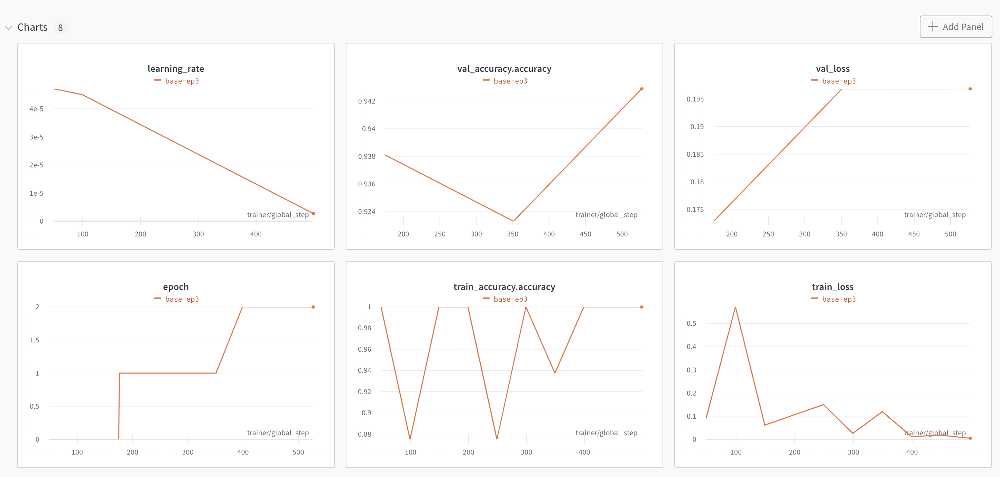

# Minimal PyTorch-Lightning NLP Template with WandB ⚡️

> Hope to customize the pipeline in detail? How about [this template with vanila PyTorch](https://github.com/youngerous/pytorch-nlp-wandb-hydra-template)?

PyTorch-Lightning template for easy use! (actually, for my own😉)
- This template is for fast prototyping of research ideas.
- This template follows [Black](https://github.com/psf/black) code formatting.
- This template contains a simple BERT classification code.
- This template contains a simple [WandB](https://wandb.ai/site) application.
- Use [Sweep](https://docs.wandb.ai/guides/sweeps) for hyperparameter tuning.
- **Note**: You should enter WandB account information on the first run.

## 1. Set Environments

### 1.1. Pull Docker Image
```sh
$ docker pull ufoym/deepo
```

### 1.2. Make Container
```sh
# You should edit some options for your environments
$ bash docker/generate_container.sh --image_name ufoym/deepo --container_name $CONTAINER_NAME --external_port 8888 
```

### 1.3. Install Required Dependencies
```sh
# Run this code on the root directory
$ pip install -r requirement.txt
```

## 2. Run Code

```sh
$ sh run.sh
```

## 3. Sample Experiment Results

### 3.1. Model Performance
|           Task           | Dataset | Model | Test Accuracy |
| :----------------------: | :-----: | :---: | :-----------: |
| Sentiment Classification |  IMDB   | BERT-base  |      93.52%      |

### 3.2. WandB Logging Results


## 4. LICENSE
[MIT License](https://github.com/youngerous/pytorch-lightning-nlp-template/blob/main/LICENSE)
